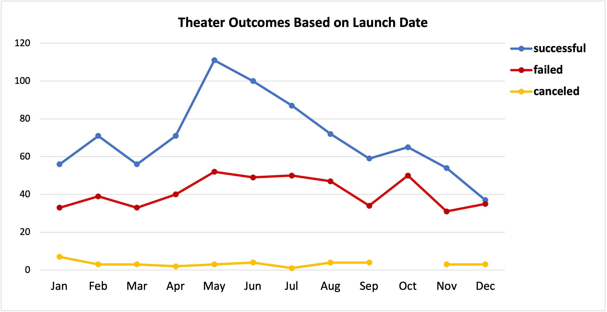
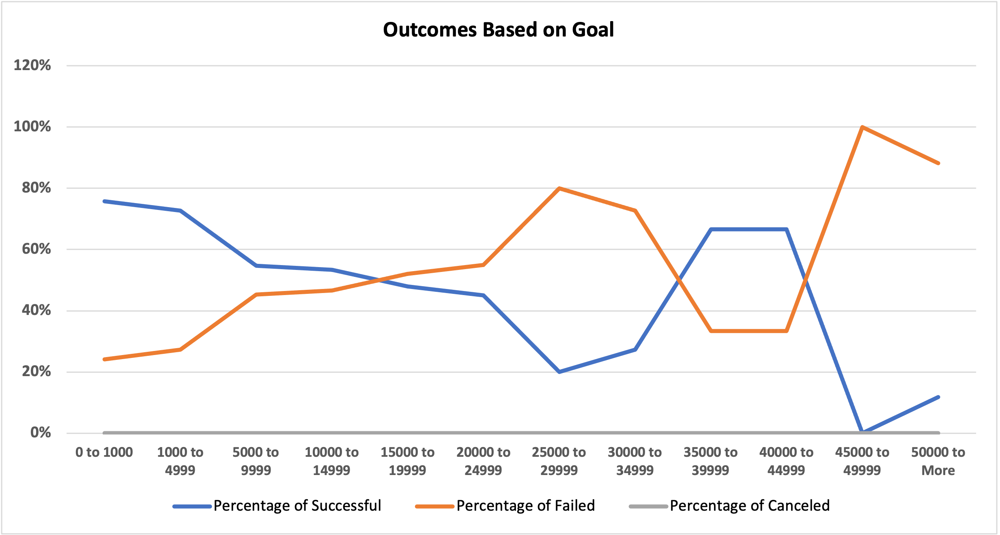

[Home: Week-1](../readme.md)

[Resource: Excel Workbook (Challenge)](./Kickstarter_challenge.xlsx)

[Resource: Lesson Activities](../lesson-1)

# Kickstarting with Excel

## Project Overview

In this project, we will analyze a dataset of [Kickstarter](https://en.wikipedia.org/wiki/Kickstarter) campaigns dating from 2009 to 2017. We will use the campaign's launch month and its monetary goal as our main criteria and filter the data to find the most successful ones in a specific category. Finally, we will display the most useful parameters in two easy-to-read charts to serve as a guide in our future campaign strategy.


## Purpose

Our goal is to create a strategy for launching a Kickstarter campaign under the [theater plays](https://en.wikipedia.org/wiki/Play_(theatre)) category with a high chance of success. There are a lot of projects that fail or are canceled midway for multiple reasons and we want to have a general notion of where those projects are situated in the distribution and any trends they may have. We also want to find a higher concentration of both failed and successful campaigns to get an accurate representation of our success rate.


## Analysis and Challenges

The data contains a lot of mixed campaign categories and information we are not interested in for this particular analysis, so the first step is to filter the data.

As the first filter criteria, our client specified:
```
outcome of theater campaigns based on launch date
```

## Analysis of Outcomes Based on Launch Date

We can start by getting the total amount of successful, failed and canceled campaigns using Excel Pivot Tables (Filtered by Category: "theater"):
|	Successful	|Failed|   Canceled|	Total|
|-----|---|-----|-----|
|	839	|493|   37|	1369|

Then we add the campaign launch date as a row but we only keep the month information. This means that all the campaigns launched in January will be added to the total January count regardless of their year or day. Finally, we can create a line chart from our resultant table:



**Comment:** Our best chance seems to launch the campaign in May, although we still more information about what other parameters make a successful campaign.

Our next step is to filter by:

```
outcome of plays based on their goals
```

## Analysis of Outcomes Based on Goals

To gain more insight into the successful campaigns and discard outliers from our dataset, we need to filter our data **and then** get a few parameters that will help improve our analysis

With Excel formulas, we can find the rows we are interested in by using:
```java
COUNTIFS(criteria, range, ...)
```

So we can gather the information for our new table with this Excel formula:

```java
=COUNTIFS(
    Subcategory, "=plays", 
    Outcomes, "=" &B$15, 
    Goals, ">=" &$I2, 
    Goals, "<" &$I3
)
```
Where Subcategory, Outcomes and Goals are named ranges in the Kickstarter spreadsheet. Also "B", "C" and "D" at 15 are "Successful, "Failed" and "Canceled" respectively, and the "I" column contains the lower and upper limits of the Goal range. The result is a more organized table with just the information we need:

| 1  |	**Goal**	|**Successful**|   **Failed**|	**Canceled**|
|----|-----|---|-----|-----|
| 2  |	0 to 1000	|141|   45|	0|
| 3  |	1000 to 4999	|388|   146|	0|
| 4  | 5000 to 10000 |93	|76	|0|
|...|...|...|...|...|
| 13 | 50000 to More |	2	|14	|0 |

Then we can get the total and percentages of each range of goals and their outcomes:

| 1  |	**Goal**	|...|**Total** | **Successful**| **Failed** | **Canceled** |
|----|-----|---|----|----|----|----|
| 2  |	0 to 1000	|...|186 | 76% | 24% |	0%  |
| 3  |	1000 to 4999|...|534 |  73%	|27%	|0% |
| 4  | 5000 to 10000|...|169 | 55%	|45%	|0% |
|...|...|...|...| ...| ...| ...|
| 13 | 50000 to More |...| 34 | 6%|	68%	 |26% |

And finally, we generate a chart using the percentage data.



**Comment:** Most projects with exceedingly high goals do not succeed, just as expected. Although we see a favorable ratio around the range of $35,000 to $50,000, the population is too small to use as an accurate statistic.

## Challenges and Difficulties Encountered

1. There are a few results that can mislead us if we don't look at all the data carefully. One example is the high rate of success on campaigns with a goal between $35,000 and $40,000 of which the population is only 6 data points. We include these outliers in the complete story of the data but we should not take them too seriously as the error rate may be too high. Case A is a more useful statistic than B in the following table:

| | **Goal** | **Total** | **Successful**| **Failed** | **Canceled** |
|----|----|----|-----|----|----|
| A | 5000 to 9999| 169	|55%	|45%	|0%
| B | 35000 to 39999 | 6 | 67%  |33% |0% |

 2. Filtering can become too convoluted if looking for many variables so we must assert that the results are consistent. For example, making sure that our percentages sum to 100% or that the "sum of the row totals" matches all the possible cases in our dataset. We can use this Excel formula to make sure we didn't miss a row:

```java
=IF(
    SUM(B14:D14) = COUNTIFS(
        Subcategory,"=plays", Outcomes,"<>live"
    ),
    SUM(B14:D14),
    "ERROR! Totals don't match."
)
```

## Results

### Conclusions about Launch Date:

1. There is a trend in campaigns having a high success rate from April to August. We can probably tie it to the general spending trends of the average pledger, as we know the end of the year can be more financially demanding.
2.  Most successful campaigns reach their goal fast and there seems to be a snowball effect from April to May as whenever projects start to succeed from the previous months, more people jump in to create theirs. It is not just an increment in the number of campaigns but the rate of success increases too as it reaches a high of 66.9% in May. 
3. Setting a 1 to 3-month campaign duration with a "reasonable" goal and launching it around the middle of May seems to be the way to go. We will see what "reasonable" means in the following section.


### Conclusions about Outcomes and Goals:

1. The $1,000 to $5,000 range has the highest data density. It has almost 300% more data points with only a 3% less success rate than the $0 to $1,000 range. It also has a 19% higher rate than the following range of $5,000 to $10,000. 
2. Anything with a goal over $15,000 is not favorable. If we want to go for a larger goal right now, we can aim for the $5,000 to $15,000 range but we probably need to do some extra work making sure there is a market/audience for the type of theater play we want our campaign to support.
3. In case we want to launch a very ambitious campaign later on we could consider the $15,000 to $25,000 range if we study each case more closely with higher domain knowledge in the "play" category. It is probably better to search for individual sponsors instead of a crowdfunding campaign at that point.

### Limitations of the dataset.

1. There is a lot of noise in the data that we can filter out by default in case we are going to revisit it in the future for more campaigns. This may include joke campaigns, outliers that may have succeeded but are too far from the mean and some campaigns with exceedingly high percentage funded.
2. "Country" may be too broad of a category when creating campaigns that need physical assistance just as a play, especially in the US. If we could narrow the data a little bit more to even regions of the US it may help a lot in knowing how much a region can influence the outcome of a project, as a play in North Dakota may not be as appealing as one in California, but I have no idea about it so more data would be useful.
3. We have been dealing with multiple currencies and I assume all the Goal and Pledge data is converted but it hasn't been clear to me yet.
4. Finally, updating the dataset to more recent dates may help us when making predictions.

### Other possible tables and graphs we can create.

1. We can solve the noise problems by getting more parameters such as interquartile range or standard deviation and then include those values in our Excel formulas to further filter the data.
2. We can better visualize the outliers problem with a Box and Whisker plot once we get rid of any cases over $50,000.
3. We should take a few more steps when creating our "Outcome and Goals" table by first removing the outliers and then changing the scale of the ranges to either a log or square root for greater granularity in the range we are more interested in ($0 to $15,000). For example:

Possible new ranges:
``` python
>>> import math
>>> 
>>> length = 10
>>> size = 5000
>>> 
>>> [int(math.log(i)*size) for i in range(1, length+1)]
[0, 3465, 5493, 6931, 8047, 8958, 9729, 10397, 10986, 11512]

>>> [int(math.sqrt(i)*size) for i in range(length)]
[0, 5000, 7071, 8660, 10000, 11180, 12247, 13228, 14142, 15000]

```
